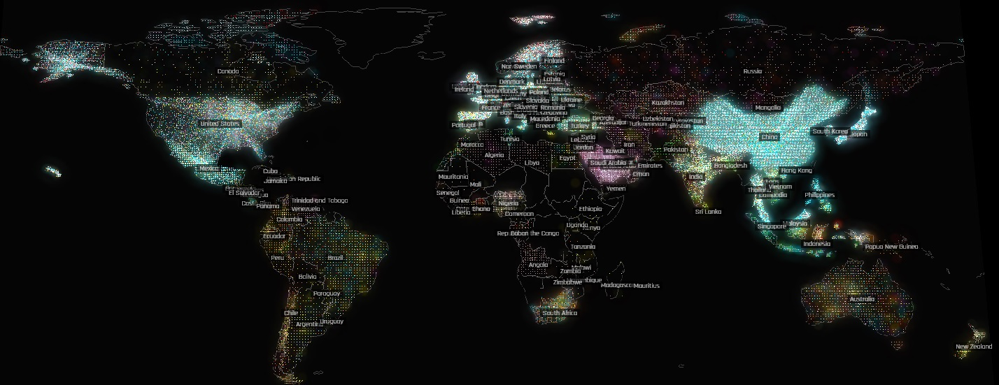

```{r, echo = FALSE}

```
## $15.3 Trillion in Global Trade -- A Visual 
*This visualization uses data compiled by Harvard University’s Center for International Development (CID) and it was sourced from the United Nations Comtrade database. For more information, please visit: http://globe.cid.harvard.edu/


## Introduction


  What do countries stand to gain by becoming allies? 

  Alliances play a pivotal role in shaping geo-political and geo-economic realities. Defensive alliances, for instance, are forged with the primary objective of collective defense, uniting nations against common threats. Non-aggressive alliances, on the other hand, prioritize cooperation without an explicit military commitment, fostering diplomatic ties and shared interests. Entente, a lesser-known and more informal arrangement, is meant to facilitate strategic collaboration and deepen mutual understanding.

  While the security-related implications of alliances are clear, how ought we characterize the relationship between alliance type and trade? Are certain alliances more adept at facilitating trade than others? How do variations in alliance types (the explanatory variable of interest) relate to patterns in trade (response variable)? Drawing on dyadic datasets located in the Correlates of War (COW) project database, this article examines the interplay between alliance types and trade value. As a central hypothesis, this article expects that defensive alliances are associated with the greatest level of trade value, and the data provides partial support for its hypothesis, albeit with a caveat. 

  A first-cut analysis suggests that both "defense" and "entente" type alliances are associated with high levels of trade value relative to "neutrality" and "non-aggression" pacts. This has theoretical implications for scholars of various sub-fields within international relations, as well as broader implications for policymakers and those working in diplomacy, international trade policy, multinational organizations, security, and so on. On the most fundamental level, this query prompts questions about the nature of association and the benefits that can be accrued through said associations. 


## Data

  The COW trade dataset tracks total national trade and bilateral trade flows between states from 1870-2014; the COW alliance dataset records all formal alliances among states between 1816 and 2012, including mutual defense pacts, non-aggression treaties, and ententes. The alliance data expands the original Singer and Small (1966) definitions of alliance types to include neutrality and non-aggression pacts separately.
  
  The first step in this cross-sectional analysis is to load the requisite .csv files and packages into R. 

```{r}

knitr::opts_chunk$set(echo = TRUE)

# Begin by loading the packages and data you will need

library(tidyverse)
library(dplyr)
library(ggplot2)
library(scales)
library(readr)
library(beeswarm)
library(modelsummary)
library(flextable)

allymemberyear <- read_csv("version4.1_csv/allymemberyear.csv")
cowd <- read_csv("COW_Trade_4.0/cowd.csv")
```


  The second step involves merging the Alliance Dataset with the Trade Dataset.

```{r}

# Begin the merger

merged <- inner_join(cowd, allymemberyear, by = c("ccode1" = "ccode", "year"))
merged$ss_type <- as.factor(merged$ss_type)

# Make the violin plot using ggplot

allied <- ggplot(merged, aes(x = ss_type, y = smoothtotrade)) +
geom_violin(fill = "cornflowerblue") +
geom_point(aes(color = ss_type), position = position_jitter(width = 0.2), alpha = 0.5) +
labs(title = "Alliance Type & Trade", x = "Alliance Type", y = "Total Trade Value (in U.S. millions)") +
scale_y_continuous(labels = scales::comma_format(scale = 1e-6)) +
scale_x_discrete(labels = c("I", "IIa", "IIb", "III")) +
guides(color = guide_legend(title = "Legend"))

# For more information on violin plots, consider visiting ggplot2tutor 
```


  For ease of viewing, I stored this figure locally and loaded it separately using the `knitr` function. 

```{r, out.width = '100%'}
# Use ggsave to locally store a version of the violin plot which is easier to see
knitr::include_graphics("graphic.png")
```


  Next, I will create a table showing the summary statistics.

```{r}

# Create a linear regression output
model <- lm(smoothtotrade ~ ss_type, data = merged)

coefficients <- coef(model)
standard_errors <- summary(model)$coefficients[, "Std. Error"]
p_values <- summary(model)$coefficients[, "Pr(>|t|)"]

# Data frame
statsheet <- data.frame(Coefficient = round(coefficients, 4),
`Standard Error` = round(standard_errors, 4),
`P-value` = p_values)

# Create labels for the coefficients
statsheet$Label <- c("Intercept", "Coefficient for Alliance Type") 

# Clean up the table
statsheet$Label <- gsub("ss_type", "Alliance Type", statsheet$Label, fixed = TRUE)

colnames(statsheet)[2] <- "Standard Error"

statsheet

# Replace 'Standard.error' with 'Standard Error' in the column names
colnames(statsheet)[2] <- "Standard Error"


# Display the table using kable
library(kableExtra)
kable(statsheet, align = "c", caption = "Regression Results") %>% 
kable_styling(full_width = FALSE)
```


## Interpreting the Results

  In this regression analysis, I examined the relationship between alliance types and total trade values. 
  
  The coefficients show the estimated change in the total trade values associated with a one-unit change in the alliance type in question (all other variables held constant). The intercept (734.8392) shows the estimated total trade value when the alliance type is Type I (defensive type). The negative coefficients for Type IIa and Type IIb indicate a decrease in total trade values compared to Type I, with Type IIa having a larger negative impact (-413.9896) than Type IIb (-372.4414). Conversely, the positive coefficient for Type III (396.5818) suggests an increase in total trade values compared to Type I. The statistically significant coefficients (Type IIa and Type III) would suggest that these alliance types are associated with a significant change in total trade values. In addition, when I calculated the p-values, they all read (0), further suggesting a that the results are significant.
  
  However, the threshold for causal inference is rather high. For the purposes of my article, I conclude (with a nominal degree of certitude) that there is a correlation between alliance type and trade value. However, do not interpret this casually, as there are endogeneity issues stemming from omitted variable biases, and there would need to be several other robustness checks that would need to take place prior to having a serious discussion about casual inference. 


## Conclusion

  Though my hypothesis is mostly correct, I was surprised to see the total trade value associated with entente alliances. I was even more stunned seeing how precipitous the drop-off was for both variations of Type II alliances. The limitations of this analysis are manifold, as the statistical analysis is rudimentary. At best, I managed to scrape the tip of the iceberg here. The violin plot shows a many-to-many relationship. In terms of confounding and threats to inference, I would imagine that the list of omitted variables is theoretically infinite. For example, there have been a proliferation of international organizations (i.e. the World Trade Organization) whose sole mandate it is to facilitate an increase in trade; perhaps the results I derived vis-à-vis alliances and trade a spurious correlation. 

  If I had more resources (e.g. time, money, etc.), I would comb through this data to model even more informative relationships. The datasets include information about alliance types and trade values for almost every country in existence, and it spans more than a century. In the COW dyadic dataset I used, there were more than 800,000 observations of 23 variables. As a first step, I would subset the data to get a more nuanced sense of how the alliance type for specific countries is correlated with trade (segmented by industry). For instance, I might analyze how the North Atlantic Treaty Organization (NATO) member states trade agricultural goods with each other before and after accession to NATO. Alternatively, I could ask a regionally-specific question to learn more about, say, how the U.S.-Japan trade relationship has been impacted by the Security Treaty. I know that there were periods of trade friction between the two nations (which are coded as spikes and dips in the COW dataset). However, it would be even more intriguing to think about broader impacts of the U.S.-Japan Security Treaty and whether other bilateral treaties are associated with similar outcomes. 
  
  In the future, perhaps a more advanced cross-sectional analysis could involve, for instance, analyzing how America's trade relationship with China changed after signing the Security Treaty with Japan. Is America's alliance with Japan associated with an increase in trade with other nations? Perhaps countries can use alliances to initially align on geo-politics, but then extend that alignment by subsequently linking their cooperation on security to a wider array of issues areas (i.e. climate change, commerce, global health, human rights, international criminal justice, etc.).
  
  *Any mistakes you find in this article are my own.